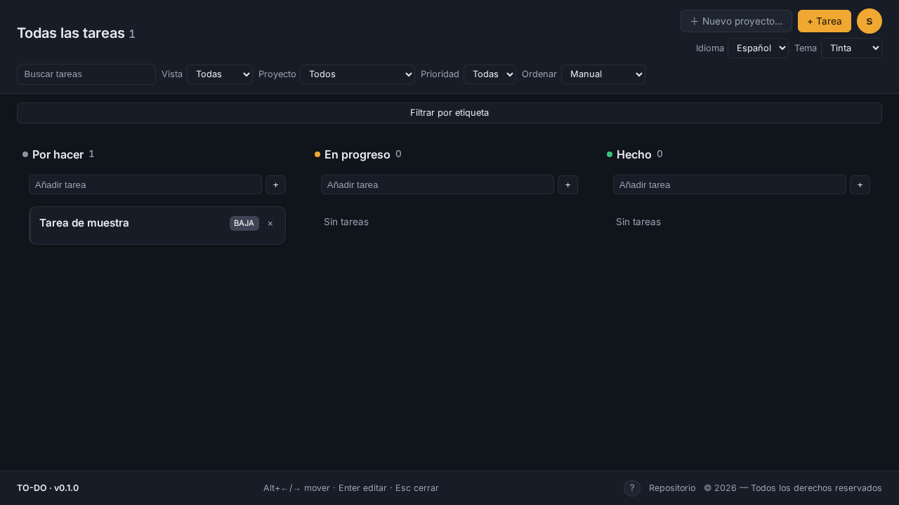

# TO-DO

A personal task manager with a Kanban board. Tasks are organized by status,
grouped by tags and projects, and scoped by date views (All / Today / Overdue /
Upcoming).



## Features

- Email/password auth with JWT access tokens and refresh-token rotation.
- Tasks: create, edit, delete (soft-delete with Undo), restore, priority, due date.
- Kanban board with three Columns, drag-and-drop and Alt+Arrow keyboard moves.
- Manual ordering within a column, subtasks (one level) with progress, tags, projects.
- Reminders, recurrence (daily/weekly/monthly), date Views, search, filters, sorting and pagination.
- Optimistic updates with rollback on failure, undo snackbar, and a single error banner.
- i18n (Spanish / English), three themes (ink / phosphor / nord), responsive layout and ARIA semantics.

## Tech stack

| Layer     | Technology |
|-----------|------------|
| Backend   | Java 21, Spring Boot 3.2.4, Spring Security + JWT (jjwt), Spring Data JPA, Flyway |
| Database  | PostgreSQL 16 |
| Frontend  | React 18, TypeScript 5 (strict), Vite 5, CSS Modules + design tokens |
| Tests     | JUnit 5 + Mockito + MockMvc (backend), Vitest + Testing Library (frontend), Playwright (E2E + visual) |
| Workflow  | OpenSpec (spec-driven changes) |

## Repository layout

```
.
├── backend/                 Spring Boot API (Maven)
│   └── src/main/java/com/example/todo/{controller,service,repository,model,dto,exception,security,config}
├── frontend/                React + Vite SPA
│   ├── src/{pages,components,context,services,data,styles}
│   └── e2e/                 Playwright specs + visual baselines
├── openspec/                Specs and archived changes
├── docs/adr/                Architecture Decision Records
├── CONTEXT.md               Domain glossary
└── docker-compose.yml       PostgreSQL
```

## Prerequisites

- JDK 21+ (and Maven on the `PATH`; there is no Maven wrapper in the repo)
- Node.js 18+ with npm (a `package-lock.json` is committed)
- Docker (for PostgreSQL)

## Quick start

### 1. Database

```bash
docker compose up -d postgres
```

PostgreSQL is exposed on `localhost:5432` (`todo_db`, user `todo`, password `todo123`).
Flyway migrations run automatically when the backend starts.

### 2. Backend

```bash
cd backend
mvn spring-boot:run
```

The API listens on `http://localhost:8080` under `/v1`.

### 3. Frontend

```bash
cd frontend
npm install
npm run dev
```

The app is served at `http://localhost:5173`; Vite proxies `/v1` to the backend on port 8080.

## Keyboard shortcuts

The board is operable without a pointer. Open the in-app help with the **?**
control in the footer, or use the list below:

| Key | Action |
|-----|--------|
| `Tab` | Move focus to a task card |
| `Enter` | Open the focused card for editing |
| `Alt` + `←` / `→` | Move the focused card to the previous / next status column |
| `Esc` | Close an open dialog |
| `Enter` | Create a task from a column's quick-add input |

## Configuration

The backend reads environment variables, all with defaults for local development
(see `.env.example`):

| Variable      | Default                                             |
|---------------|-----------------------------------------------------|
| `DB_URL`      | `jdbc:postgresql://localhost:5432/todo_db`          |
| `DB_USER`     | `todo`                                               |
| `DB_PASSWORD` | `todo123`                                            |
| `JWT_SECRET`  | dev-only secret (override in any non-local environment) |

## Testing

Integration tests use a real PostgreSQL instance (no Testcontainers), so start
the database first:

```bash
docker compose up -d postgres
```

| Scope            | Command                                          | Notes |
|------------------|--------------------------------------------------|-------|
| Backend unit + integration | `cd backend && mvn test`              | Requires PostgreSQL |
| Frontend unit/component    | `cd frontend && npm test -- --run`    | Vitest + happy-dom |
| Frontend typecheck + build | `cd frontend && npm run build`         | Runs `tsc --noEmit` then `vite build` |
| E2E + visual regression    | `cd frontend && npx playwright test`  | Requires backend on :8080 and frontend dev server on :5173 |

Visual baselines live in `frontend/e2e/__screenshots__/`. Update them with
`npx playwright test --update-snapshots` and review the image diff.

## API overview

All routes are under `/v1` and require a `Bearer` token except the auth routes.

- `POST /auth/register`, `POST /auth/login`, `POST /auth/refresh`
- `POST /auth/reset-request`, `POST /auth/reset-verify`, `PUT /auth/reset-change`
- `GET|POST /tasks`, `GET|PUT|DELETE /tasks/{id}`, `POST /tasks/{id}/restore`
- `PATCH /tasks/{id}/status`, `PATCH /tasks/{id}/position`
- `GET /tasks/reminders`, `POST /tasks/{id}/reminder-ack`, `GET /tasks/{id}/subtasks`
- `GET|POST /tags`, `DELETE /tags/{id}`
- `GET|POST /projects`, `PUT|DELETE /projects/{id}`

Errors use a single envelope: `{error}` for simple errors and
`{error, errors}` for validation failures.

## Password reset

There is no email delivery in this app: `POST /v1/auth/reset-request` returns the
6-character code in its response, and the forgot-password page displays it.

To try it manually:

1. Register and sign in, then log out.
2. Open `/forgot-password`, enter your email and click **Enviar código** — the code appears on the page.
3. Click **Continuar** (goes to `/reset/<code>`), set a new password twice and submit.
4. Sign in with the new password.

This flow is covered end to end by `frontend/e2e/password-reset.spec.ts`.

## Architecture and decisions

- `CONTEXT.md` — the domain glossary (what each term means).
- `docs/adr/` — Architecture Decision Records, numbered sequentially.
- `openspec/specs/` — capability specs; `openspec/changes/archive/` — history.

The backend is layered (`controller → service → repository`) with a thin
controller, ownership enforced through `CurrentUserProvider`, and one error
contract. The frontend routes every data operation through the `TaskRepository`
port and drives the board through a `useBoard` controller hook.

## Notes

- There is no CI pipeline; run the suites locally as above.
- The Vite dev server must be running for E2E, and the backend must be up too
  (Playwright drives the real stack, not mocks).

## License

No license. All rights reserved.
