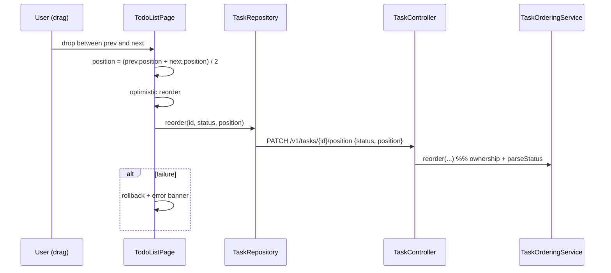

# Design

## Context

See `proposal.md` — Why. `handleStatusChange` already does optimistic status updates with rollback; drag-and-drop (`handleDrop`) currently only changes status. `add-task-query` introduces an optional sort; manual order is the board's default intra-column order.

## Goals / Non-Goals

**Goals:**
- Persist an arbitrary order with cheap inserts (no renumbering on every move).
- Reuse the existing optimistic+rollback pattern.

**Non-Goals:**
- Conflict-free concurrent reordering, per-column custom sorts, a visible rebalance control.

## Decisions

1. **`position` as a `double`, midpoint insertion** (chosen).
   - Rationale: inserting between neighbors needs no rewrite of the column.
   - Alternative: integer positions with renumbering — rejected: O(n) writes per move.
   - Alternative: linked list (`nextId`) — rejected: more complex reads.
2. **Atomic `{status, position}` reorder endpoint** (chosen) so a cross-column drag is one request.
   - Alternative: separate status PATCH + position PATCH — rejected: two round-trips, partial states.
3. **Rebalance a column when neighbors get too close** (`distance < 1e-6`): rewrite that column's positions as `1,2,3,...` (chosen).
   - Alternative: ignore — rejected: floating point collapse after many inserts.
4. **Explicit sort overrides manual order** (chosen): when the user picks a sort in `add-task-query`, the board sorts by it; otherwise it orders by `position`.
   - Alternative: always manual — rejected: the sort control would be inert.

## Reorder flow

## Migration Plan

`V9__add_task_position.sql`: `ALTER TABLE tasks ADD COLUMN position DOUBLE PRECISION NOT NULL DEFAULT 0;`. Rollback drops the column.

## Test Strategy

- **Unit (backend):** `TaskOrderingServiceTest` — ownership, parse status, finite position; tie-break by `createdAt`.
- **Integration (backend, Postgres):** reorder within and across columns; invalid status/position -> structured 400; 403/404.
- **Component (frontend):** column ordered by position; drag within a column computes the midpoint and calls `reorder`; failure rolls back.
