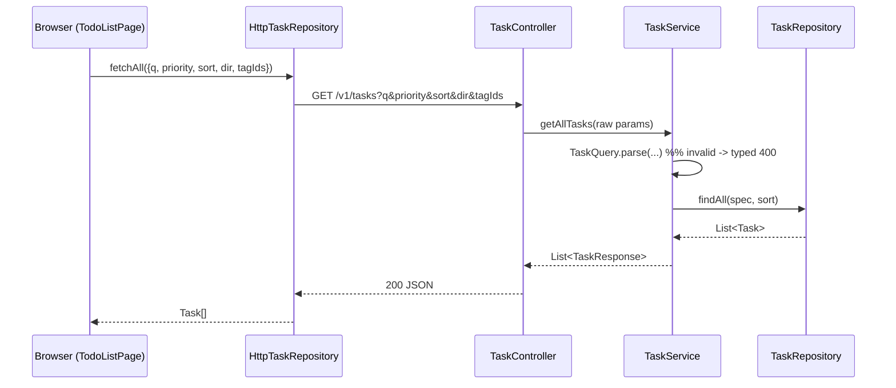

# Design

## Context

See `proposal.md` — Why. Today `TaskController.getAllTasks` branches on an optional `status` and delegates to `TaskService.getAllTasks` / `getAllTasksByStatus`, which call `TaskRepository.findByUser` / `findByUserAndStatus`. There is no search, ordering or multi-filter. The Task module already owns status parsing and maps typed failures to the unified `{error, errors}` 400 contract; the query work should follow the same shape.

## Goals / Non-Goals

**Goals:**
- One composable, validated query path for the task list; parsing stays out of the controller.
- Backward compatible: no params => current behavior.
- Frontend owns query state and forwards it through the repository seam.

**Non-Goals:**
- Pagination/virtualization, ranking/relevance, saved filters, multi-key sort.
- A new search engine (Postgres `LIKE`/`ILIKE` is enough at this scale).

## Decisions

1. **`TaskQuery` record as the query seam, parsed in the Task module** (chosen).
   - `com.example.todo.dto.TaskQuery` (record) holds normalized `status`, `q`, `priority`, `tagIds`, `sort`, `dir`; a static factory parses raw params and throws a typed failure on invalid values.
   - Alternative: parse in the controller — rejected: violates "thin controller" and reintroduces generic conversion errors.
   - Alternative: Spring `@ModelAttribute` binding — rejected: binds enums before validation and cannot produce the structured field-level body easily.

2. **`JpaSpecificationExecutor` + `Sort` in the repository** (chosen).
   - Specifications compose `q` (ILIKE on title/description), `priority`, `tagIds` (ANY join), `status`; `Sort` carries field/direction with `nullsLast()` for `dueDate`.
   - Alternative: hand-written JPQL with `:param is null or ...` — rejected: repetitive and awkward for the tag join and null ordering.
   - Alternative: in-memory filtering in the service — rejected: loads the whole table and hides the cost.

3. **Default direction depends on the field**: `desc` for `createdAt`, `asc` otherwise (chosen).
   - Rationale: newest-first is the expected default; date/priority/title read naturally ascending.
   - Alternative: always `asc` — rejected: regresses the current "newest first" feel.

4. **Frontend `TaskQuery` type + `fetchAll(query?)`** (chosen). `InMemoryTaskRepository` applies the same semantics so component tests stay network-free.
   - Alternative: keep filtering client-side — rejected: diverges from the API and does not scale.

## Seam and public interface

```
TaskQuery (record)
  + status: TaskStatus | null
  + q: String | null
  + priority: Priority | null
  + tagIds: List<Long>
  + sort: TaskSortField        (enum: createdAt|dueDate|priority|title)
  + dir: SortDirection         (enum: asc|desc)

TaskService.getAllTasks(TaskQuery query): List<TaskResponse>
TaskQuery.parse(status, q, priority, tagIds, sort, dir): TaskQuery   // typed failure on invalid
```

## Query flow



## Risks / Trade-offs

- [ILIKE `%q%` cannot use a plain index] -> acceptable at personal scale; the scoped-by-user predicate keeps it bounded. Revisit (FTS/pg_trgm) only if it hurts.
- [Null ordering differs across databases] -> pin `nullsLast()` explicitly and cover it with an integration test.
- [Frontend and backend query semantics drift] -> the `InMemoryTaskRepository` mirrors the HTTP semantics and both are tested against the same scenarios.

## Migration Plan

No data model change; no Flyway migration. Rollback is code-only (remove params + controls).

## Test Strategy

- **Unit (backend):** `TaskQuery.parse` — valid parsing, default direction, invalid `sort`/`dir`/`priority` raise the typed failure.
- **Integration (backend, MockMvc + Postgres):** search, priority+tag filters, `sort=dueDate&dir=asc` with nulls last, invalid values -> exact structured 400.
- **Unit (frontend):** `InMemoryTaskRepository.fetchAll(query)` filters/orders; `HttpTaskRepository` encodes params.
- **Component (frontend):** board search box debounces and re-queries; sort/priority controls update the query.
- **E2E (Playwright):** type a query, assert narrowing, clear, assert restore.
