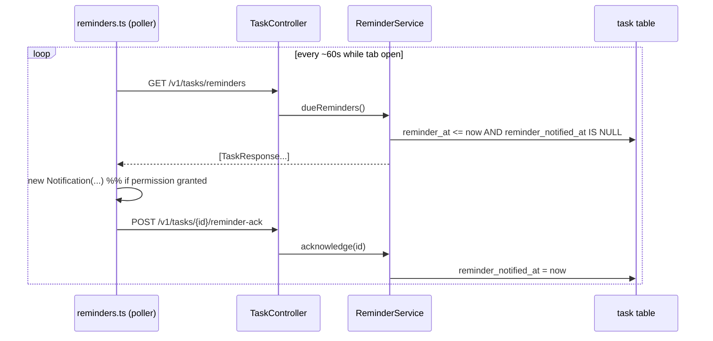

# Design

## Context

See `proposal.md` — Why. Tasks already have `dueDate` (`LocalDate`); there is no scheduler, no email/push service, and the frontend has the browser `Notification` API. Ownership and the `{error, errors}` contract already exist and are reused.

## Goals / Non-Goals

**Goals:**
- Let a task carry an explicit reminder moment and deliver it once, in-app.
- Keep delivery idempotent and multi-tab safe via server state.

**Non-Goals:**
- Email/push, recurring reminders, snooze, time-zone-aware scheduling beyond the browser's local clock.

## Decisions

1. **Explicit `reminderAt` + `reminderNotifiedAt` columns** (chosen).
   - Rationale: a reminder moment distinct from the due date; `reminderNotifiedAt` gives idempotency and multi-tab safety in the DB.
   - Alternative: derive reminders from `dueDate` — rejected: less control (always 9am? day before?).
   - Alternative: a server scheduler — rejected: extra infra (a timer thread) for a personal app; due-ness computed on read is enough.
2. **Frontend polling + Web Notifications** (chosen). `frontend/src/services/reminders.ts` polls `GET /v1/tasks/reminders` every ~60s while the tab is open, shows a `Notification` per item, then calls `reminder-ack`.
   - Alternative: SSE/WebSocket — rejected as scope; a personal app does not need push latency.
   - Alternative: email/push — impossible: no service available.
3. **`ReminderService` as the seam** (`dueReminders`, `acknowledge`) with the endpoints on `TaskController` delegating.
   - Alternative: a dedicated `ReminderController` — noted as a future split; keeping it on `TaskController` avoids a routing layer for two endpoints.

## Delivery flow

## Risks / Trade-offs

- [Permission denied / notifications unsupported] -> fall back to an in-app indicator only; never crash the poller.
- [Two tabs open] -> the `reminderNotifiedAt` flag is set before the second tab's next poll, so at most one duplicate is possible; acceptable.
- [Malformed/absolute timestamps and time zones] -> store an absolute timestamp; the frontend sends an ISO instant; comparisons use the server clock.

## Migration Plan

Flyway `V5__add_task_reminders.sql`: `ALTER TABLE tasks ADD COLUMN reminder_at TIMESTAMP NULL, ADD COLUMN reminder_notified_at TIMESTAMP NULL;`. Rollback drops both columns.

## Test Strategy

- **Unit (backend):** `ReminderService` — due set excludes future/notified; `acknowledge` idempotent and ownership-aware.
- **Integration (backend, MockMvc + Postgres):** reminder field round-trip on create/update; `GET /reminders` returns only due; `POST /reminder-ack` then empty; 403/404.
- **Unit (frontend):** `reminders.ts` shows one Notification per due item and acks; no-op without permission.
- **Component (frontend):** in-app indicator reflects unacknowledged reminders.
