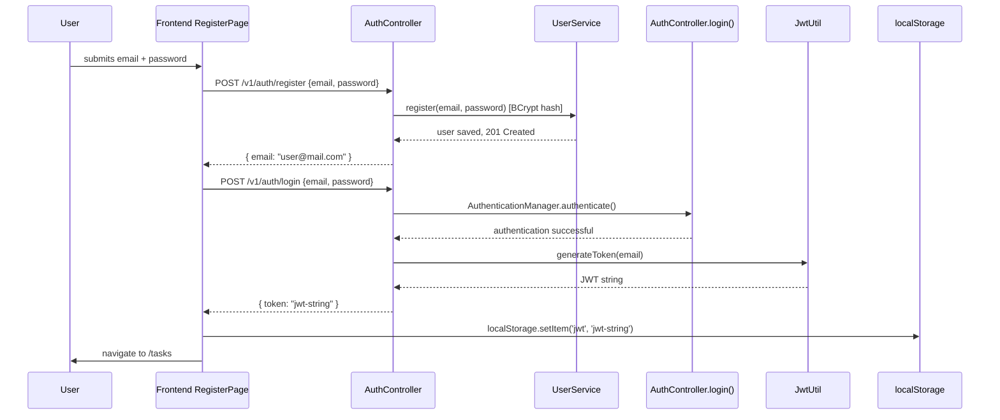

# Design — Full Stack Functional Fix

## Context

El proyecto ya cuenta con:
- **Backend**: Spring Boot 3.2.4, JWT (JJWT 0.11.5), BCrypt, Spring Security con filtro personalizado `JwtAuthenticationFilter`, H2 in-memory, Spring Validation starter presente en pom.xml pero sin usar.
- **Frontend**: React 18 + TypeScript + Vite 5 + React Router DOM 6 + Axios (sin interceptor).
- **Estructura de directorios**: `backend/src/main/java/com/example/todo/{controller,dto,model,service,repository,config}` y `frontend/src/{pages,services,context,components}`.

El cambio aborda los bloqueadores que impiden el funcionamiento: API calls sin auth headers, registerPage incorrecto, falta de ruta /register, DTOs sin validación, base de datos en-memoria con pérdida de datos.

## Goals / Non-Goals

**Goals:**
- Frontend: interceptor Axios inyecta Authorization header automáticamente; RegisterPage funciona correctamente con auto-login y navegación; ruta `/register` accesible desde login.
- Backend: DTOs validados con Bean Validation (400 al fallar); JWT secret configurable vía variable de entorno; CORS orientado a producción.
- Infraestructura: PostgreSQL persistente en docker-compose.yml reemplaza H2 in-memory.

**Non-Goals:**
- No se modifica el formato de respuesta del API (mismos JSON, mismos status codes).
- No se implementa logout con blacklist de tokens.
- No se agregan tests E2E ni CI/CD pipeline.
- No se migra MUI al código frontend (se deja como dependencia instalada sin uso).

## Decisions

### DECISION 1: Axios interceptor en lugar de llamadas manuales por request
**Alternativas consideradas:**
- A) Llamar `axios.withConfig()` o agregar headers manualmente en cada función ApiService.ts.
- B) Interceptor global en instancia axios que lea localStorage.

**Decisión elegida: B.** Un interceptor global en la instancia axios es más mantenible — añade una única fuente de verdad para el header Authorization. Si localStorage cambia (e.g., key name different), se actualiza en un solo lugar. El interceptor lee `localStorage.getItem('jwt')` y si existe, inyecta `Authorization: Bearer <token>` antes del request. Se añade un handler de error que detecta 401, limpia auth state local y redirige a /login.

```typescript
// ApiService.ts — enfoque propuesto
const api = axios.create({ baseURL: '/v1' });

api.interceptors.request.use(config => {
  const token = localStorage.getItem('jwt');
  if (token) config.headers.Authorization = `Bearer ${token}`;
  return config;
});

api.interceptors.response.use(
  res => res,
  err => {
    if (err.response?.status === 401) {
      localStorage.removeItem('jwt');
      localStorage.removeItem('email');
      window.location.href = '/login';
    }
    return Promise.reject(err);
  }
);

export const getTasks = () => api.get('/tasks');
// ... rest of functions unchanged (already use /v1/tasks path which matches baseURL: /v1)
```

### DECISION 2: Auto-login tras registro en vez de redirección al login
**Alternativas consideradas:**
- A) Tras registro exitoso, redirigir a /login para que el usuario ingrese contraseña.
- B) Tras registro exitoso, llamar automáticamente POST /v1/auth/login con las mismas credenciales y navegar a /tasks.

**Decisión elegida: B.** El backend no devuelve token en la respuesta de registro (solo retorna `{ email: "..." }`), por lo que el flujo requiere un segundo request para obtener el token. Auto-login elimina un paso obligatorio del usuario, mejorando la experiencia sin comprometer seguridad — las credenciales ya fueron validadas por BCrypt al registrar y ahora se reutilizan inmediatamente.

Flujo de secuencia (Mermaid):


### DECISION 3: PostgreSQL en docker-compose.yml en vez de configuración manual del host
**Alternativas consideradas:**
- A) Configurar usuario y contraseña de PostgreSQL en application.properties hardcodeado.
- B) Leer credenciales de variables de entorno con defaults para development-local.
- C) Docker-compose.yml con imagen oficial y vars de entorno, application.properties lee `${var:default}`.

**Decisión elegida: C.** docker-compose.yml centraliza el servicio PostgreSQL con `POSTGRES_DB=todo_db`, `POSTGRES_USER=todo`, `POSTGRES_PASSWORD=todo123` (dev-only). application.properties usa `${db.url:jdbc:postgresql://postgres:5432/todo_db}` y `${db.user:todo}`, lo que permite override con `.env` o variables de sistema. Para producción, se pasan vars de entorno reales sin comprometer credenciales hardcodeadas.

### DECISION 4: `@Valid` en controller methods en vez de validación manual
**Alternativas consideradas:**
- A) Validar manualmente dentro del service layer (mezcla concerns).
- B) Usar `@Valid` + `ResponseEntityExceptionHandler` para errors estructurados.
- C) Custom Validator annotation con lógica de negocio compleja.

**Decisión elegida: B.** Spring Boot ya incluye `spring-boot-starter-validation` en pom.xml. Agregar `@Valid` al parámetro del request body en cada controller method activa Bean Validation automáticamente. Spring maneja los errores 400 con cuerpo JSON (`{timestamp, status, error, detail, ...}`) sin necesidad de código adicional. Las anotaciones en DTOs son declarativas y auto-documentadas.

### DECISION 5: CORS específico `http://localhost:5173` en vez de wildcard
**Alternativas consideradas:**
- A) Wildcard `*` (actual) — simple pero inseguro para credenciales con CORS.
- B) Lista fija de orígenes permitidos, leída desde propiedad de Spring.
- C) Wildcard `*` pero sin credentials habilitados.

**Decisión elegida: B.** Lista `[http://localhost:5173]` (Vite dev default port) es más explícita que wildcard. Para producción se puede usar `${frontend.url:http://localhost:5173}` para override mediante variable de entorno sin recompilar.

## Risks / Trade-offs

| Risk | Probabilidad | Impacto | Mitigación |
|------|-------------|---------|------------|
| docker-compose no corre localmente (sin Docker instalado) | Baja | Media | application.properties usa `${var:default}` — si postgres no responde, Spring Boot falla rápido. Se puede revertir a H2 en minutos sin tocar código. |
| Auto-login duplica un request POST al backend tras registro | Baja | Baja | Un solo request adicional (~50ms). El usuario nota mejor UX (sin paso intermedio de login manual). |
| Axios interceptor intercepta todos los requests incluyendo fetch internos del framework React | Baja | Baja | Interceptor solo modifica requests con `Authorization` header; no afecta fetch/axios calls sin necesidad de auth. |
| Bean Validation 400 responses cambian formato de error vs respuesta vacía actual | Alta | Baja (breaking) | El contrato del API cambia de "acepta vacío" a "rechaza con detalle", lo cual es correcto según el spec REQ-BV-*. Los consumers existentes (solo este frontend) se actualizan simultáneamente. |

## Migration Plan

1. **Crear docker-compose.yml** y ejecutar `docker compose up -d postgres` (una vez).
2. **Actualizar backend pom.xml**: reemplazar `<dependency>h2</dependency>` por `org.postgresql:postgresql`.
3. **Actualizar application.properties**: cambiar datasource URL, dialect, driver; agregar `${todo.security.jwt.secret}` default fallback largo y aleatorio (no inseguro como el actual).
4. **Actualizar CORS** en SecurityConfig.java a lista fija `[http://localhost:5173]`.
5. **Añadir Bean Validation annotations** a DTOs (`RegisterRequest.java`, `LoginRequest.java`, `TaskRequest.java`).
6. **Añadir `@Valid`** al parámetro del request body en AuthController methods y TaskController create/update methods.
7. **Actualizar frontend ApiService.ts**: crear instancia axios con baseURL `/v1` y agregar interceptor auth + error handler 401.
8. **Actualizar frontend RegisterPage.tsx**: llamar `registerUser()`, auto-login, navigate a /tasks.
9. **Actualizar frontend App.tsx**: añadir `<Route path="/register" ... />`.
10. **Actualizar frontend LoginPage.tsx**: añadir enlace "¿No tienes cuenta? Registrarse".
11. **Limpiar duplicado vite.config.ts** (o .js) — eliminar el redundante.

## Test Strategy by Layer

| Capa | Tipo de prueba | Alcance | Comando |
|------|---------------|---------|---------|
| Backend DTO Validation | Unit | Mockear @Valid en cada controller method, verificar 400 con errores | `mvn test -Dtest=AuthControllerTest` (crear nuevo) |
| Backend DTO Validation | Integration | Real request POST /v1/auth/register con datos inválidos → 400 | `mvn test -Dtest=ApiIntegrationTests` (actualizar) |
| Backend Task CRUD + Validation | Integration | Crear task sin title → 400; crear con title válido → 201 | `mvn test -Dtest=TaskCrudIntegrationTest` (actualizar) |
| Frontend Axios Interceptor | Unit | Mockear localStorage, verificar interceptor inyecta header | `npm run test -- ApiService.test.ts` (crear nuevo) |
| Frontend RegisterPage | Unit + Integration | Render con @testing-library/react, simular submit → verifica llamada registerUser() y navegación | `npm run test -- RegisterPage.test.tsx` (crear/actualizar) |
| Backend PostgreSQL | Integration | docker-compose up + flyway o H2 para tests unitarios en CI | `mvn test -Dspring.profiles.active=test` (perfilear profile test con H2) |

Note: Para que los integration tests de Spring Boot funcionen con PostgreSQL en desarrollo pero mantener H2 en CI, se configura un perfil `test` en application.properties con datasource H2 in-memory, y el perfil default usa PostgreSQL.
