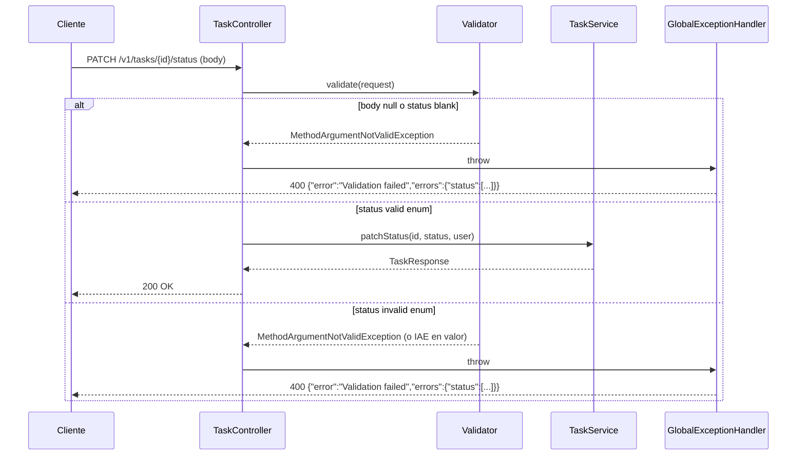

# Design

## Context

Estado actual (motivación en proposal.md — Why):

- `RegisterRequest.java`: campo `password` con SOLO `@Size(min=6)` (null-safe → NPE en BCrypt).
- `StatusUpdateRequest.java`: campo `status` con `@NotBlank(message = "Status must not be blank")` (YA tiene, pero el controller no lo aplica).
- `TaskController.patchStatus()` (línea 113): `@RequestBody StatusUpdateRequest request` **sin** `@Valid`.
- `GlobalExceptionHandler` (de C5): `MethodArgumentNotValidException`→400 con `{"errors":{...}}` (ya mapea `@Valid` fallido).
- Stack: Java 21, Spring Boot 3.2.4, `spring-boot-starter-test` (JUnit5+Mockito+MockMvc). Patrón de test: `TaskCrudIntegrationTest`.

## Goals / Non-Goals

**Goals:**

- `RegisterRequest.password` + `@NotBlank(message = "Password must not be blank")`.
- `TaskController.patchStatus()` + `@Valid`.

**Non-Goals:**

- No hay cambios de frontend (mostrar errores 400 → C3).
- No hay cambios de otros DTOs (`LoginRequest`, `TaskRequest` ya tienen `@Valid`).

## Diagrama de secuencia (patchStatus con @Valid)

## Decisions

### D1 — `@NotBlank` en `RegisterRequest.password`

- Añadir `@NotBlank(message = "Password must not be blank")` junto a `@Size(min=6)`.
- El `@NotBlank` valida que el String no sea null ni vacío (`"".blank()` → true).
- Alternativas:
  - (a) Validación manual en `UserService.register()` — descartado: `@Valid` es el mecanismo estándar de Spring; el handler de C5 ya mapea `MethodArgumentNotValidException`.
  - (b) `@Size(min=6)` sin `@NotBlank` — descartado: `@Size` es null-safe, así que null pasa; `"".blank()` también pasa `@Size(min=6)` (longitud 0 < 6), pero mejor ser explícito con `@NotBlank`.

### D2 — `@Valid` en `TaskController.patchStatus()`

- Añadir `@Valid` al parámetro `StatusUpdateRequest request`.
- El handler de C5 (`MethodArgumentNotValidException`→400) ya mapea el error con field-level details.
- Alternativas:
  - (a) Validación manual (if null/blank → 400) — descartado: duplica lógica; `@Valid` es el estándar.
  - (b) `@Valid` + `@NotBlank(message = "...")` en StatusUpdateRequest — ya tiene `@NotBlank` (sin cambios necesarios).

### D3 — Nuevo requirement ADDED en task-status

- Añadir "PATCH Status Update Endpoint" como nuevo requirement ADDED (no MODIFIED, porque no hay requirements existentes que cubran este endpoint).
- Preservar los 11 escenarios existentes (ninguno de ellos menciona PATCH `/v1/tasks/{id}/status`).
- Alternativas:
  - (a) MODIFIED a "Task Update Includes Status" — descartado: ese requirement cubre PUT, no PATCH; son endpoints distintos con semánticas distintas (partial vs. full update).

## Estrategia de tests por capa

- **Unit (JUnit5 + Mockito, sin contexto Spring)**:
  - Extender `GlobalExceptionHandlerTest` (de C5): aserto de 400 con body estructurado para `MethodArgumentNotValidException` (`status` blank).
- **Integration (`@SpringBootTest` + MockMvc)**:
  - Extender `ErrorContractIntegrationTest` (de C5) con:
    - POST `/v1/auth/register` con `password: null` → 400 + `errors.password`.
    - PATCH `/v1/tasks/{id}/status` con body `null` → 400.
    - PATCH `{"status": ""}` → 400 + `errors.status`.
    - PATCH `{"status": "INVALID"}` → 400 (interceptado por `TaskStatus.valueOf("INVALID")` → IAE → handler de C5).
    - PATCH `{"status": "ACTIVE"}` → 200.
- **e2e (Playwright)**: ninguno.

## Risks / Trade-offs

- [`@NotBlank` en password es compliance con REQ-BV-001 existente] → los tests de `backend-validation` ya esperan este mensaje; al commit, los tests existentes deben pasar.
- [`@Valid` en patchStatus es un cambio de 1 palabra] → el comportamiento antes era "null/invalid → catch IAE → body null"; ahora es "null/invalid → 400 con body estructurado". El frontend no lee el body de error del PATCH (solo verifica el estado 200).
- [PATCH `{"status": "INVALID"}` es capturado por `TaskStatus.valueOf()` catch en TaskController, no por `@Valid`] → aceptado: el catch IAE → `ResponseEntity.badRequest().body(null)` existe; después de añadir `@Valid`, el `status` vacío va por `@Valid` (400 con body estructurado), el `INVALID` va por el catch IAE (400 sin body). Si se desea cuerpo estructurado para `INVALID`, se puede añadir un `@Valid` custom o mover el catch al handler de C5 (no-goal de C5).

## Migration Plan

- Deploy: commit único, sin migraciones; `mvn package` normal.
- Rollback: revert del commit restaura password sin `@NotBlank` y patchStatus sin `@Valid`.
- Orden en el portfolio: este cambio va quinto (C4); depende de C5 (handler de 400).

## Open Questions

- (ninguno)
