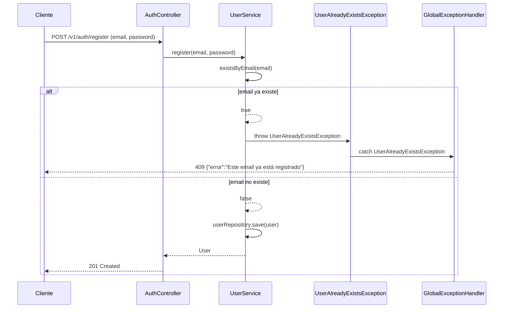

# Design

## Context

Estado actual (motivación en proposal.md — Why):

- `UserService.register()`: pre-check `existsByEmail` → lanza `IllegalArgumentException` crudo (→500 en vez de 409). (G2)
- `GlobalExceptionHandler` (creado en C1) mapea solo 401/403/404 con cuerpos vacíos.
- `RegisterRequest.password` tiene SOLO `@Size(min=6)` — le falta `@NotBlank` (G1: null → NPE en BCrypt → 500). Este campo se corrige en C5.
- `TaskController.patchStatus()` sin `@Valid` → body null → NPE → 500. Este campo se corrige en C5.
- La spec de "Task Due Date" indica timestamp `2024-12-31T23:59:59Z` cuando la implementación usa `LocalDate` + `<input type="date">` → `yyyy-MM-dd`.
- Stack: Java 21, Spring Boot 3.2.4, `spring-boot-starter-test` (JUnit5+Mockito+MockMvc), PostgreSQL + Flyway. Patrón de test integration: `TaskCrudIntegrationTest` (`@SpringBootTest` + `@AutoConfigureMockMvc`).

## Goals / Non-Goals

**Goals:**

- Nueva excepción `UserAlreadyExistsException` (runtime) para el 409 de email duplicado.
- `GlobalExceptionHandler` mapea 409 (estructurado) y 400 (con `MethodArgumentNotValidException`, agrupado por campo).
- Corrección de la spec "Task Due Date" a date-only `yyyy-MM-dd`.

**Non-Goals:**

- No se añaden `@NotBlank`/`@Valid` a `RegisterRequest`, `LoginRequest`, `StatusUpdateRequest` → `enforce-backend-request-validation` (C5).
- No hay cambios de frontend beyond los casos de error 409/400 → `unify-frontend-http-client` (C3).
- No se migra la columna `date` a `timestamp`: ADR a favor de mantener date-only.
- No se añade handler genérico `DataIntegrityViolationException`→409 (false-positive con la unique de tags de C3).

## Diagrama de flujo de error

## Decisions

### D1 — `UserAlreadyExistsException` (runtime) con protección de carrera

- `UserService.register()`: pre-check `existsByEmail` → lanzar `UserAlreadyExistsException`; envolver `userRepository.save(user)` en try-catch `DataIntegrityViolationException` → re-lanzar `UserAlreadyExistsException` (carrera entre pre-check y insert).
- **NO** añadir handler genérico `DataIntegrityViolationException`→409 (false-positive con la unique de tags de C3).
- Alternativas:
  - (a) Solo pre-check — descartado: race condition bajo concurrencia real.
  - (b) `DataIntegrityViolationException` genérica → 409 — descartado: la unique de tags (C3) podría dispararla (nombre duplicado), causando falso positivo.

### D2 — `MethodArgumentNotValidException`→400 con cuerpo estructurado por campo

- Agrupar `getFieldErrors()` por campo: `{"error":"Validation failed","errors":{<campo>:[mensajes]}}`.
- Alternativas:
  - (a) Cuerpo de error genérico (sin detalles) — descartado: las specs de `backend-validation` exigen field-level details.
  - (b) `errors` como array plano — descartado: la agrupación por campo es más usable para el frontend (muestreo en `RegisterPage.tsx`).

### D3 — ADR: mantener `date` (no `timestamp`) en `Task.dueDate`

- La implementación usa `LocalDate`, columna `date` en PostgreSQL, `<input type="date">` en el frontend → `yyyy-MM-dd`.
- La spec de "Task Due Date" indica `2024-12-31T23:59:59Z` (timestamp), pero es un error.
- Decisión: corregir la spec a date-only, no migrar la columna (cambio de esquema más trabajo de lo necesario).

### D4 — Extensiones al `GlobalExceptionHandler` existente (de C1)

- Se extiende en el mismo archivo (`GlobalExceptionHandler.java`), agregando dos nuevos `@ExceptionHandler`.
- Alternativas:
  - (a) Nuevo handler separado — descartado: rompe la convención de un único `@RestControllerAdvice` del proyecto (C1 lo establece).
  - (b) Handler genérico `RuntimeException`→500 — descartado: se busca contract uniform, no manejo genérico.

## Estrategia de tests por capa

- **Unit (JUnit5 + Mockito, sin contexto Spring)**:
  - Extender `GlobalExceptionHandlerTest` (de C1) con asertos de 409 (`UserAlreadyExistsException`) y 400 (`MethodArgumentNotValidException`, body estructurado por campo).
- **Integration (`@SpringBootTest` + MockMvc, patrón `TaskCrudIntegrationTest`)**:
  - `ErrorContractIntegrationTest` — 2 usuarios registrados/logueados (A, B); A intenta re-registrarse → 409 + mensaje; B registra con password <6 → 400 + `errors.password`; B registra con email malformado → 400 + `errors.email`; B login con email vacío → 400 + `errors.email`; A crea task con `dueDate:"2024-12-31"` → 201 + eco `2024-12-31`.
- **e2e (Playwright)**: ninguno (sin cambios de frontend).

## Risks / Trade-offs

- [409 con cuerpo estructurado es nuevo para clientes] → los clientes actuales no esperan este formato; la spec ya lo exige; no hay clientes externos (app de 1 sesión).
- [catch `DataIntegrityViolationException` solo en `UserService.register()`] → aceptado: no se generaliza (false-positive con la unique de tags de C3). La carrera entre pre-check y save es improbable en la carga esperada, pero se cubre la vía principal.
- [`GlobalExceptionHandler` crece con más handlers] → manejable: 5 handlers en total; cada uno es un método pequeño; los tests unitarios cubren cada mapeo.
- [ADR de date-only: el frontend `new Date('2024-12-31')` produce timezone shift] → el frontend no parsea la fecha; la muestra del backend la devuelve como string `yyyy-MM-dd`; el `input type="date"` lo consume directamente sin parseo.

## Migration Plan

- Deploy: commit único, sin migraciones; `mvn package` normal.
- Rollback: revert del commit restaura los 500 actuales; `GlobalExceptionHandler` pierde los handlers de 409/400 y `UserAlreadyExistsException` se elimina (solo código).
- Orden en el portfolio: este cambio va segundo (C5); extiende el `GlobalExceptionHandler` de C1; `enforce-backend-request-validation` (C5) asume el handler de 400.

## Open Questions

- (ninguno)
