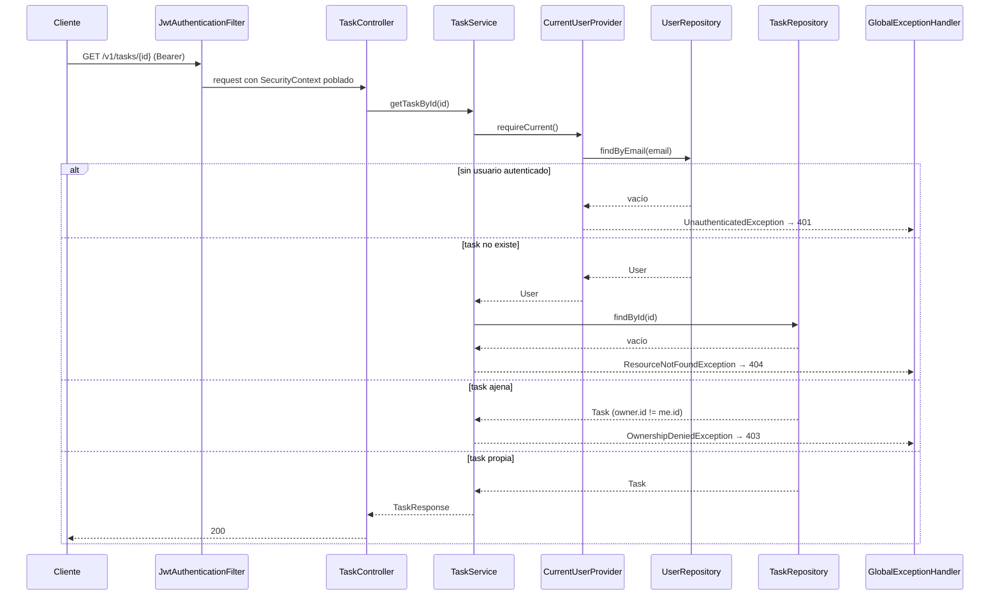
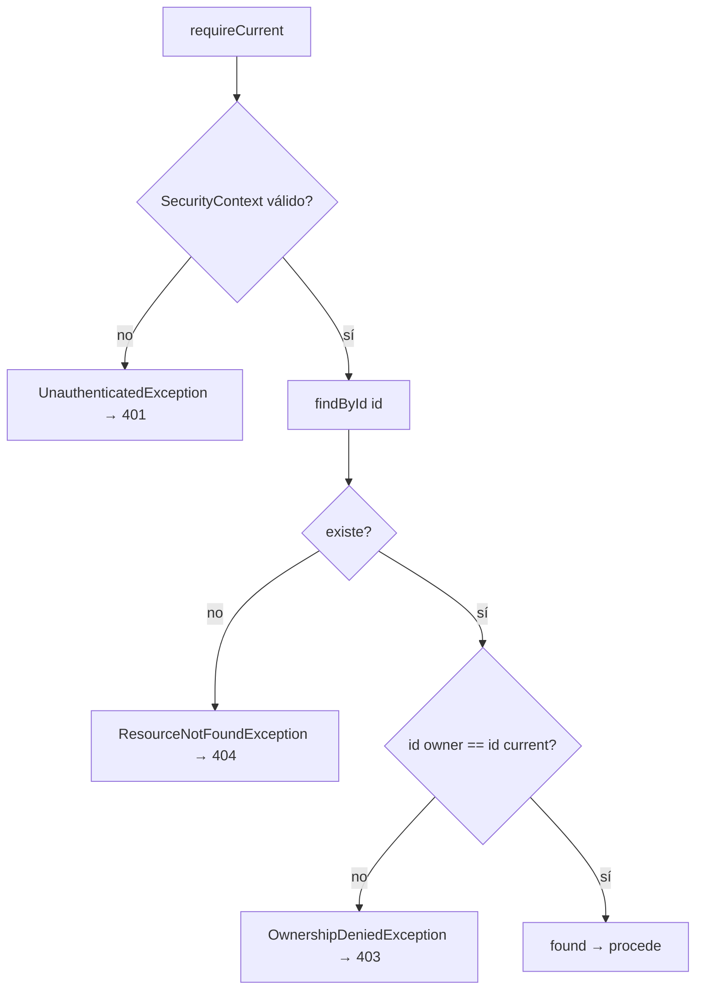

# Design

## Context

Estado actual (motivación en proposal.md — Why):

- 5 call sites de ownership: `TaskService.getTaskById:56-60`, `updateTask:82-103`, `deleteTask:105-112`, `patchStatus:114-122` y `TagController.deleteTag:76-77`, todos con `findById` + `filter(user.equals)`.
- `User` (`com.example.todo.model.User`) sin `equals`/`hashCode` → comparación por referencia.
- `getCurrentUser()` duplicado en `TaskController:134-149` y `TagController:84-99`: `SecurityContextHolder` → principal (`org.springframework.security.core.userdetails.User` o `String`) → `userRepository.findByEmail(email)`. Hoy hay exactamente 1 `findByEmail` + 1 `findById` por request (no hay doble query; el problema es localidad y testabilidad).
- 401/404 deciden los controllers (`optUser.isEmpty()` → 401; `Optional.empty()`/`false` → 404); no existe `@RestControllerAdvice` en el proyecto.
- Stack: Java 21, Spring Boot 3.2.4, `spring-boot-starter-test` (JUnit5 + Mockito + MockMvc), PostgreSQL + Flyway. Patrón de test integration: `TaskCrudIntegrationTest` (`@SpringBootTest` + `@AutoConfigureMockMvc`, register/login por HTTP, Bearer token).

## Goals / Non-Goals

**Goals:**

- Un solo punto de resolución SecurityContext → `User` por request.
- Una sola operación de ownership con 3 estados (found / not-found / forbidden) y 1 query DB.
- 401/403/404 decididos en la seam y mapeados por un único handler.
- `TaskService` y `CurrentUserProvider` testeables a nivel unitario sin contexto HTTP.

**Non-Goals:**

- Sin cambios de esquema DB, de `SecurityConfig`/JWT filter, de estructura JSON de respuestas.
- Sin contrato de errores más allá de los 3 estados de ownership (409/400 → `establish-api-error-contract`, C5).
- Sin caché request-scoped: el seam se llama una vez por método de service/controller (1 `findByEmail` por request, igual que hoy).

## Diagrama de secuencia (flujo nuevo)

Decisión de ownership (3 estados, 1 query):

## Decisions

### D1 — Una sola seam: `CurrentUserProvider` (`com.example.todo.security`, `@Component`)

Métodos:

- `Optional<User> current()` — SecurityContext → email → `findByEmail`; vacío si no hay authentication válida (anonymous, principal no reconocido).
- `User requireCurrent()` — lanza `UnauthenticatedException` si no hay usuario.
- `User requireOwned(Long ownerId)` — la operación de ownership: `requireCurrent()` + compara `me.getId()` con `ownerId`; lanza `OwnershipDeniedException` si no coincide. Es la única decisión de "puedo actuar sobre este recurso".

Alternativas:

- (a) Status quo (5 call sites) — descartado: bug de referencia + duplicación.
- (b) Argument resolver `@CurrentUser User` — descartado: acopla la capa web a la resolución y cambia los 7 endpoints; menos locality.
- (c) `UserDetailsService` que devuelva `User` + caché — descartado: toca `JwtAuthenticationFilter`/`UserDetailsService` (cambio mayor, territorio C5/C1).

### D2 — Ownership = `findById` + comparación por `id` (1 query, 3 estados)

- Alternativa (a) query derivada `findByUserIdAndId` — descartado: un resultado vacío no distingue 404 de 403 sin un segundo `findById`; además ensancha la superficie de repositorios.
- Alternativa (b) mantener `findById` + `filter(user.equals)` con `equals` arreglado — descartado: la decisión se queda repartida en cada call site y los retornos `Optional`/`boolean` pierden el estado 403.
- Comparación por `id` (no por entidad) porque es inmune a usuarios detached (tests unitarios, transacciones futuras) y no depende de semántica de `equals`.

### D3 — 3 estados como excepciones tipadas + un `GlobalExceptionHandler`

- `com.example.todo.exception`: `OwnershipDeniedException` → 403, `ResourceNotFoundException` → 404, `UnauthenticatedException` → 401. `GlobalExceptionHandler` (`@RestControllerAdvice`) mapea **solo** esas 3.
- Alternativa (a) if/else en cada controller — descartado: re-reparte la decisión (el problema original).
- Alternativa (b) `AccessDeniedException` de Spring Security — descartado: su mapeo por defecto lo intercepta el `ExceptionTranslationFilter` (no controlamos el cuerpo ni el 401), y confunde "sin principal" con "principal sin permiso".
- Alternativa (c) re-spec a 404 para todo (info-leakage) — descartado: las specs principales exigen 403 explícitamente; se cumple la spec. La decisión queda registrada aquí como ADR corto (un `docs/adr/` formal es follow-up, no-goal).
- Cuerpos de 403/404/401: vacíos (igual que hoy; el contrato de cuerpo de error es C5).
- **Nota de implementación (ajuste sobre Non-Goal)**: para que una request **sin token** devuelva 401 (spec user-authentication REQ-UAC-001) y no el 403 por defecto de Spring Security, se añade en `SecurityConfig` un `authenticationEntryPoint` mínimo que escribe `401` (`http.exceptionHandling().authenticationEntryPoint(...)`). Con `.anyRequest().authenticated()` y sin entry point custom, Spring Security rechaza la request no autenticada con 403 **antes** de llegar al controller/service, así que el mapeo `UnauthenticatedException`→401 del `GlobalExceptionHandler` nunca se activaría en ese caso. El entry point solo fija el estado 401 (cuerpo vacío, coherente con D3); no cambia el JWT filter ni la resolución de usuarios. Esto toca `SecurityConfig` aunque está en Non-Goals; se documenta aquí como desviación mínima exigida por la spec y verificada por `OwnershipApiIntegrationTest.unauthenticatedReturns401`.

### D4 — `User.equals`/`hashCode` por `id` (null-safe)

- `equals`: `other instanceof User` y `Objects.equals(id, other.id)`; `hashCode`: `Objects.hashCode(id)`.
- Alternativas: por `email` (mutable, no es la identidad de la FK `user_id`), o seguir por referencia (el bug).
- Impacto verificado: `findByUser(User)` / `findByNameAndUser` (Spring Data) no usan `equals` (bind por id de la asociación); los `filter(user.equals)` se reemplazan. El cambio es puramente aditivo.

### D5 — Firmas de `TaskService`: sin parámetro `User`; el service resuelve al usuario

- `getTaskById(id)`, `updateTask(id, request)`, `deleteTask(id)`, `patchStatus(id, status)`, `createTask(request)`, `getAllTasks()`, `getAllTasksByStatus(status)`: resuelven `User me = currentUser.requireCurrent()` dentro y lanzan las excepciones tipadas (ya no devuelven `Optional`/`boolean` para estados de error).
- `createTask`/`updateTask` usan `me` para `task.setUser(me)` y `resolveTag(me, name)` (el helper interno conserva su parámetro `User`).
- Controllers quedan delgados: `return ResponseEntity.ok(taskService.getTaskById(id));` — sin checks 401/404/403 locales. `TagController.deleteTag`: `findById` → `orElseThrow(ResourceNotFoundException::new)` → `currentUser.requireOwned(tag.getUser().getId())` → delete.
- Alternativa: el controller resuelve y pasa `User` al service — descartado (D1): 7 checks de 401 duplicados y el service vuelve a ser in-testable sin mock de provider.

### D6 — Un solo cambio (regla ">3 archivos → proponer dividir")

- Alternativa: dos cambios ("resolver" y "ownership") — descartado: estado intermedio con el bug activo y la matriz de tests 403/404 sin dónde vivir. Un cambio con tareas pequeñas y gates propios (tasks.md).

## Estrategia de tests por capa

- **Unit (JUnit5 + Mockito, sin contexto Spring)**:
  - `CurrentUserProviderTest` — `UserRepository` mockeado; `SecurityContextHolder` poblado/limpiado en `@BeforeEach`/`@AfterEach`: autenticado → `current()` resuelve; anonymous → vacío; `requireCurrent()` sin usuario → `UnauthenticatedException`; `requireOwned` propio/ajeno.
  - `TaskServiceTest` — mocks de `TaskRepository`, `TagRepository`, `CurrentUserProvider`: para get/update/delete/patch-status: propio → OK; ajeno → `OwnershipDeniedException`; inexistente → `ResourceNotFoundException`; sin usuario → `UnauthenticatedException`.
  - `GlobalExceptionHandlerTest` — instancia directa (sin Spring): cada excepción → estado esperado.
- **Integration (`@SpringBootTest` + MockMvc, mismo patrón que `TaskCrudIntegrationTest`)**:
  - `OwnershipApiIntegrationTest` — 2 usuarios registrados/logueados (A, B); A crea task T1, T2 y tag G; matriz: A GET/PUT/DELETE/PATCH propios → 2xx; B GET/PUT/DELETE/PATCH de T1 → 403; GET id inexistente → 404; B DELETE G (tag de A) → 403; DELETE tag inexistente → 404; sin token → 401.
- **e2e (Playwright)**: ninguno (sin cambios de frontend).

## Risks / Trade-offs

- [El cambio 404→403 en accesos cruzados es visible para clientes] → las specs vigentes lo exigen; el frontend no tiene flujos cruzados (1 sesión = 1 usuario); `OwnershipApiIntegrationTest` fija el comportamiento nuevo.
- [`GlobalExceptionHandler` introduce el primer `@RestControllerAdvice` del proyecto] → mapea solo las 3 excepciones nuevas; sin handlers genéricos (no cambia el manejo de validación/500 actual; eso es C5).
- [`User.equals` con `id` null → siempre false] → aceptado: los usuarios transient no se comparan en esta app; los tests usan usuarios persistidos.
- [Las firmas del service cambian (rompen cualquier llamada directa a `TaskService`)] → único caller es `TaskController` (mismo commit); los tests unitarios nuevos cubren la interfaz.
- [La integration test depende del mismo entorno DB que `TaskCrudIntegrationTest` (PostgreSQL vía docker-compose)] → sin infra nueva; si el gate de proyecto (`mvn test`) pasa hoy, pasa igual.

## Migration Plan

- Deploy: commit único, sin migraciones; `mvn package` normal.
- Rollback: revert del commit (ver proposal.md — Rollback Plan).
- Orden en el portfolio: este cambio va primero (C2); `establish-api-error-contract` (C5) asume este `GlobalExceptionHandler` y lo extiende.

## Open Questions

- (ninguno)
