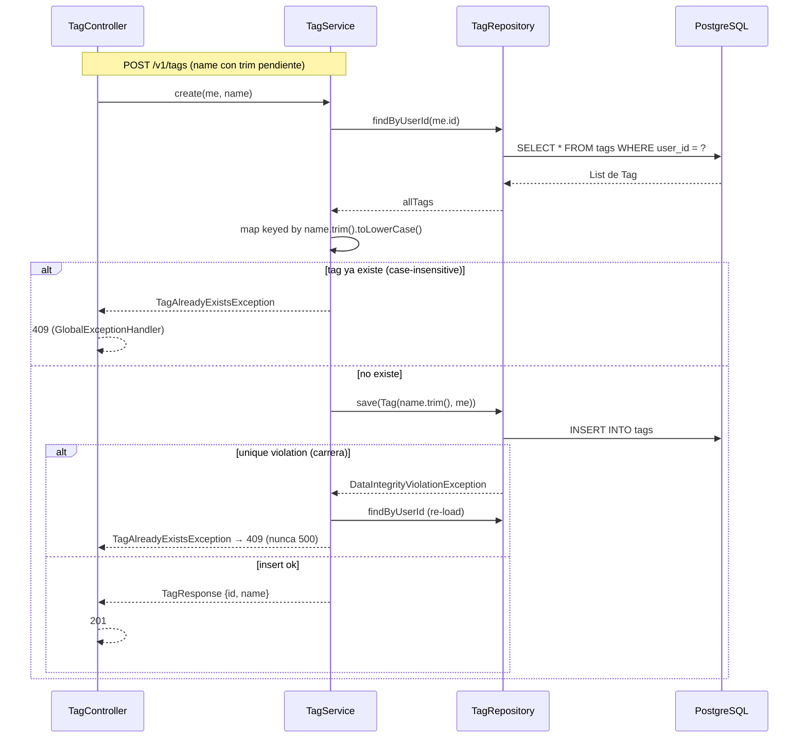
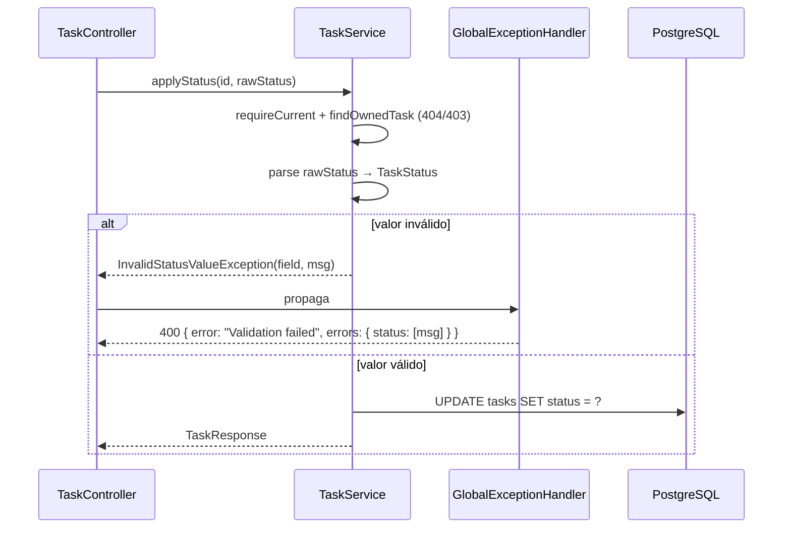

# Design

## Context

Estado actual (motivación en `proposal.md` — Why):

- `TagController` (`backend/src/main/java/com/example/todo/controller/TagController.java`) guarda `TagRepository` directamente: `createTag` hace match exacto `findByNameAndUser(name, user)` sin trim, body = entidad `Tag` sin validación, duplicado → 409 solo en match exacto, carrera → `DataIntegrityViolationException` → 500 (sin handler); `getAllTags` devuelve `List<Tag>` — Jackson serializa `Tag.user` (getter público: `password` BCrypt + `email`) y `Tag.tasks`.
- `TaskService.resolveTag` (líneas 59-93) duplica la identidad de tag: `TransactionTemplate` por **cada** tag name → `findByUserId` completa + map (N transacciones en create/update) y el save de la task queda **fuera** de la transacción → tags huérfanos commiteados si falla el save.
- `TaskController.patchStatus` (líneas 78-86) hace `TaskStatus.valueOf` manual → 400 body vacío; `TaskRequest.status` es enum `TaskStatus` → valor inválido en POST/PUT muere en Jackson (`HttpMessageNotReadableException`) → 400 body vacío, sin field-level details.
- `TagRepository` expone 3 métodos (`findAllByUser`, `findByNameAndUser`, `findByUserId`); los dos primeros solo los usa `TagController`.
- Frontend: `TaskRepository` es una interface de 6 passthroughs; `HttpTaskRepository.create` hace `task as any`; `TodoListPage.handleSave` hace `data as any` ×2; `ApiService.updateTask(id, task: any)`; `AddTaskModal` `onSave: (data: any)` + `existingTags?: any[]`. El wire de create/update exige `tagNames: string[]` mientras el dominio `Task` tiene `tags: Tag[]` — un caller que pase dominio real crea la task sin tags en silencio (el backend ignora `tags`). El modal envía `dueDate: ''` y el backend espera `yyyy-MM-dd` u omitido (Jackson no parsea cadena vacía como `LocalDate`) → el adapter debe omitir campos opcionales vacíos.
- Test infrastructure: PostgreSQL real vía `docker-compose.yml` (raíz del repo; `DB_URL=jdbc:postgresql://localhost:5432/todo_db`), `ddl-auto=validate` + Flyway; patrón integration = `@SpringBootTest` + `@AutoConfigureMockMvc` (ver `TaskCrudIntegrationTest`); frontend = Vitest (`npx vitest run`), los tests actuales mockean `ApiService` y asercion delegación.
- Stack: Spring Boot 3.x (Java), `TransactionTemplate` ya inyectada en `TaskService`; TypeScript estricto (Vite + Vitest).

## Goals / Non-Goals

**Goals (nivel diseño):**

- Un solo owner de la identidad de tag (normalización, batch lookup, race, uniqueness): módulo `TagService` con API pública de 4 operaciones.
- La entidad `Tag` nunca cruza la seam HTTP: `TagResponse {id, name}` en `GET/POST /v1/tags`.
- Create/update de task atómico: resolve + save en una transacción, retry de la operación completa.
- Una sola operación de status (`applyStatus`) con failure tipado mapeado al 400 estructurado; controllers sin lógica de negocio.
- Frontend: interface de board tipada + 2 adapters (`HttpTaskRepository` + `InMemoryTaskRepository`) + `TaskInput`; conversión domain↔wire visible y testeable; sin `any` en la seam.

**Non-Goals (nivel diseño):**

- No se toca el schema: la unique constraint `(user_id, name)` sigue siendo el último resguardo; sin migración ni índices.
- No se introduce un gestor de transacciones nuevo: se reutiliza `TransactionTemplate`/`PlatformTransactionManager` existentes.
- No hay módulo `useTasks` (paso 2 opcional de la revisión, diferido).
- No cambia endpoint alguno ni el contrato de auth.

## Diagrama de secuencia — Módulo Tag (create + resolve)



```mermaid
sequenceDiagram
    participant TC as TaskController
    participant TS as TaskService
    participant TT as TransactionTemplate
    participant TG as TagService
    participant R as Repositories
    participant DB as PostgreSQL

    TC->>TS: createTask(request)
    loop hasta 2 intentos (DIVE)
        TS->>TT: execute( lambda )
        TT->>DB: BEGIN
        TS->>TG: resolve(me, tagNames) — UNA findByUserId + map
        TG->>R: save(missing tags)
        R->>DB: INSERT tags
        TS->>R: save(task)
        R->>DB: INSERT tasks
        alt todo ok
            TT->>DB: COMMIT
        else DIVE en tag
            TT->>DB: ROLLBACK (incluye tags)
            Note over TS: re-ejecuta la operación completa; el re-resolve reusa el tag commiteado por la tx concurrente
        end
    end
    TS-->>TC: TaskResponse
```

## Diagrama de secuencia — Status (PATCH/PUT)



## Decisions

### D1 — `TagService` como módulo profundo con API pública de 4 operaciones

- `com.example.todo.service.TagService` (nuevo, `@Service`), constructor inyectado con `TagRepository` + `CurrentUserProvider`:
  - `List<TagResponse> list(User me)` — `findByUserId` + orden alfabético case-insensitive (mismo comparador que el actual `TagController.getAllTags`).
  - `TagResponse create(User me, String name)` — trim → lookup case-insensitive → existe: `TagAlreadyExistsException` (409); no existe: `save(Tag(name.trim(), me))`; si el save lanza `DataIntegrityViolationException` → re-lookup normalizado → `TagAlreadyExistsException` (409). Sin loop: una DIVE en la constraint `(user_id, name)` siempre significa creador concurrente.
  - `void delete(User me, Long id)` — `findById` (404) → `currentUser.requireOwned(tag.getUser().getId())` (403) → `delete`. El ownership se mantiene centralizado en la seam C1, pero lo ejecuta el módulo (como `TaskService.findOwnedTask`), no el controller.
  - `List<Tag> resolve(User me, List<String> names)` — **una** `findByUserId` + map keyed por `name.trim().toLowerCase()`; retorna los tags existentes y crea en memoria los missing (los `save` dentro de la transacción del caller). Duplicados normalizados en el input (`["Work","work"]`) se colapsan a un solo tag (`Set<Tag>` del task dedup). Sin `TransactionTemplate` propio: se ejecuta dentro de la tx del caller (task create/update).
- `TagController` queda delegate delgado (patrón `TaskController`): resuelve `currentUser.requireCurrent()` y delega.
- Alternativas:
  - (a) Reglas en el controller (estado actual) — descartado: módulo controller shallow; la interfaz es casi tan compleja como la implementación.
  - (b) `resolve` sigue en `TaskService` y `TagService` solo CRUD — descartado: la identidad de tag (la parte bug-prone) seguiría fuera del módulo.
- `TagRepository` se reduce a `findByUserId(Long)` (los CRUD heredados cubren el resto); `findAllByUser` y `findByNameAndUser` se eliminan.

### D2 — Atomicidad de task: retry de la operación completa en `TaskService`

- `TaskService.createTask`/`updateTask` se reescriben como: `TransactionTemplate.execute(...)` que (1) llama `tagService.resolve(me, names)` (una sola vez, batch), (2) asigna los tags al task, (3) `taskRepository.save(task)`. Loop de máx 2 intentos alrededor de la `execute` completa, catch solo `DataIntegrityViolationException` (misma semántica C3, ahora a nivel de operación).
- Consecuencia: si el save de la task falla, el rollback incluye los tags resueltos (no quedan huérfanos); el retry re-ejecuta resolve+save y el re-resolve reusa los tags commiteados por la tx concurrente.
- `resolve` sin `TransactionTemplate` propio: con `PROPAGATION_REQUIRED` implícito (repository joins) se une a la tx del caller; `create` (POST `/v1/tags`) corre en la tx del método del repository (Spring Data), suficiente para su único `save`.
- Alternativas:
  - (a) `TransactionTemplate` por tag (estado actual, C3) — descartado: N transacciones por task y sin atomicidad con el save del task.
  - (b) `@Transactional` en `createTask` — descartado: no da retry automático y mezcla policy (retry) con declaration.
  - (c) `PESSIMISTIC` lock en tags — descartado: serializa la tabla (análisis C3).

### D3 — `TagResponse` en la seam; `TagRequest` nuevo; la entidad no cruza HTTP

- `GET /v1/tags` → `List<TagResponse>` (solo `id` + `name`, orden alfabético). `POST /v1/tags` → 201 `TagResponse`. Body: `com.example.todo.dto.TagRequest` (nuevo) con `@NotBlank @Size(min=1, max=50) String name` + `@Valid` en el controller → 400 field-level vía el handler `MethodArgumentNotValidException` existente.
- El nuevo `TagAlreadyExistsException` (extiende RuntimeException) se mapea en `GlobalExceptionHandler` → 409 body vacío (misma respuesta observable que el 409 actual).
- Alternativas:
  - (a) `@JsonIgnore` sobre `Tag.user`/`Tag.tasks` — descartado: la entidad sigue cruzando la seam; cada nuevo getter es un riesgo de fuga (el bug actual es exactamente esto).
  - (b) Jackson mix-in para el shape — descartado: implícito y frágil ante cambios del DTO.
  - (c) 409 con body field-level — descartado: la spec permite "409 Conflict or 422" y el body vacío es la respuesta observable actual; no romper lo que ya cumple spec.

### D4 — `TaskRequest.status` a `String` + una sola operación `applyStatus`

- `TaskRequest.status` cambia de `TaskStatus` (enum) a `String` (opcional). `StatusUpdateRequest.status` ya es `String` (con `@NotBlank`); se mantiene.
- `TaskService.applyStatus(Long id, String rawStatus)` — la única operación que muta status: `requireCurrent` + `findOwnedTask` (404/403) → parse estricto `TaskStatus` (match exacto de nombre, sin trim ni case-folding: el vocabulario de status es contrato cerrado de API, no free-text como el nombre de tag) → set + save + `toResponse`.
- Parse inválido → `InvalidStatusValueException(field="status", message="Status must be PENDING, ACTIVE or COMPLETED")` (nuevo, lleva el nombre del field y el mensaje) → `GlobalExceptionHandler` lo mapea al shape **idéntico** del `@Valid`: `{"error":"Validation failed","errors":{"status":[msg]}}`.
- `createTask`: status null/ausente → default `PENDING` (constructor de `Task`, sin cambios); status presente → mismo parse (failure tipada). `updateTask`: status null → conserva el actual; presente → mismo parse. Un único helper de parse compartido = la garantía "one status value per request" vive en el módulo, no en el controller.
- `TaskController.patchStatus` elimina el `valueOf` manual: delega `taskService.applyStatus(id, request.getStatus())`.
- Alternativas:
  - (a) Mantener binding de enum en `TaskRequest` — descartado: el valor inválido muere en Jackson (`HttpMessageNotReadableException`) con 400 body vacío, sin información de field, y el parse queda fuera del módulo.
  - (b) Bean Validation constraint custom `@ValidTaskStatus` sobre el field `String` — descartado: produce el mismo 400 field-level, pero duplica la regla en el edge (validator) y en el módulo; el patrón exception→handler (C1/C2) centraliza la regla en el módulo con menos piezas.
  - (c) `valueOf` en el controller (estado actual) — descartado: regla de negocio en el controller + 400 body vacío.

### D5 — Frontend: interface de board + `TaskInput` + dos adapters

- `frontend/src/services/types/task.ts` — nuevo `TaskInput { title: string; description?: string; priority: Priority; status: TaskStatus; dueDate?: string; tagNames: string[] }`. Es el **único** tipo de input aceptado por `create`/`update`: un `Task` de dominio (con `tags: Tag[]`) ya no es assignable (falta `tagNames`) → la trampa de "tags en silencio" se elimina por tipado, no por convención.
- `frontend/src/data/TaskRepository.ts`:
  - Interface profunda: `fetchAll()`, `create(input: TaskInput)`, `update(id, input: TaskInput)`, `move(id, status: TaskStatus)`, `remove(id)`, `listTags()`.
  - Helpers de conversión puros y exportados: `toWire(input: TaskInput)` → body de request (omite `dueDate`/`description` vacíos; `tagNames` tal cual) y `fromWire(wire)` → `Task` de dominio (`tags` garantizado como array, default `[]`; status default `PENDING`). La conversión vive en el adapter, visible y testeable.
  - `HttpTaskRepository(client?)` — constructor con client inyectable (default: `ApiService`); posee `toWire`/`fromWire`; `move` → `patchStatus`, `remove` → `deleteTask`.
  - `InMemoryTaskRepository` — estado en memoria (`tasks: Task[]`, `tags: Tag[]`), implementa la interface completa sin red; `create`/`update` registran las `tagNames` nuevas en `tags` (ids autoincrementales); `move` muta el estado; `remove` filtra. Dos adapters = la seam es real.
- `frontend/src/services/ApiService.ts` — `updateTask(id: number, task: TaskInput)` (adieu `any`).
- `frontend/src/pages/TodoListPage.tsx` — `handleSave(data: TaskInput)`; `as any` desaparece; `repository.update/create/move/remove`.
- `frontend/src/components/AddTaskModal.tsx` — `onSave: (data: TaskInput) => void`, `existingTags: Tag[]` (tipado, no `any[]`); `handleSubmit` ya produce `TaskInput` (`tagNames: string[]`).
- Alternativas:
  - (a) 1 adapter + tests con `ApiService` mocked (estado actual) — descartado: la test asercion delegación cementa la shallowness (el diseño de C6 eligió ese patrón; la revisión la marca de vuelta).
  - (b) Módulo `useTasks` (paso 2 opcional de la revisión) — diferido: el estado optimista + rollback de la page es un cambio de estado con su propio diseño; no es prerequisito de la seam tipada.

## Estrategia de tests por capa

- **Backend unit (JUnit5 + Mockito, sin contexto Spring)**:
  - `TagServiceTest` (nuevo, mocks de `TagRepository`/`CurrentUserProvider`): `create` con existente case-insensitive ("work" vs "Work") → `TagAlreadyExistsException`; `create` nuevo → `save` con nombre trimmed; `create` cuyo `save` lanza DIVE → re-lookup → 409 (no 500); `list` → solo `TagResponse`; `delete` → 404/403/204 vía la seam; `resolve` con N nombres → `findByUserId` **una** vez (`verify(times(1))`), existing por key + missing creados.
  - `TaskServiceTest` (extendido): `createTask` → `tagService.resolve` una vez con todos los nombres (batch); save de task que falla → la `execute` lanza y el TransactionTemplate rollback se verifica (transacción del caller); `applyStatus` válido → set+save; inválido → `InvalidStatusValueException`; `updateTask` con status inválido → mismo failure.
- **Backend integration (`@SpringBootTest` + MockMvc, PostgreSQL de docker, patrón `TaskCrudIntegrationTest`)**:
  - `TagApiIntegrationTest` (nuevo): (a) POST `/v1/tags` `{"name":" Personal "}` → 201 + name `Personal`; (b) con `Work` existente, POST `{"name":"work"}` → 409 y `GET /v1/tags` sin rows nuevos; (c) `GET /v1/tags` → cada elemento tiene **solo** `id` y `name` (JsonPath: sin `user`, el body no contiene `"password"`); (d) 2 hilos POST el mismo nombre nuevo → {201, 409}, ninguna 500, 1 row; (e) POST `{"name":""}` → 400 con `errors.name`.
  - `ErrorContractIntegrationTest` (extendido): PATCH `/v1/tasks/{id}/status` `{"status":"INVALID"}` → 400 `errors.status`; PUT `/v1/tasks/{id}` `{"status":"INVALID"}` → 400 `errors.status` (nuevos, cumplen los escenarios del delta task-status).
  - `TagResolutionIntegrationTest` / `TaskCrudIntegrationTest` / `OwnershipApiIntegrationTest` deben seguir verdes sin cambios de aserción (la conducta observable de task/tags por task no cambia).
- **Frontend (Vitest)**:
  - `TaskRepository.test.ts` (reescrito): suite compartida que se ejecuta contra `InMemoryTaskRepository` (flujo completo board, sin red) y contra `HttpTaskRepository` con un **client stub** inyectado que registra las requests wire (no mock del módulo): `create` con `tagNames: ["Work","Personal"]` → body wire contiene `tagNames` exactos; `create` con `dueDate: ''` → body wire **sin** `dueDate`; `fetchAll` con wire de response → dominio con `tags: Tag[]`; `move`/`remove` → las calls wire esperadas.
  - `AddTaskModal.test.tsx` (nuevo, pendiente del plan de tests de C6): render, completar form, `onSave` llamado con `TaskInput` (`tagNames: string[]`), toggle de pills de tags.
  - `TodoListPage.test.tsx` (actualizado a la interface nueva: `remove`/`move`).
- **e2e (Playwright)**: ninguno — no cambia la UI.
- **Gate** (misma convención del portfolio): `cd backend && docker compose up -d && mvn test`; `cd frontend && npx vitest run && npm run build`.

## Risks / Trade-offs

- [BREAKING: `GET/POST /v1/tags` cambia de shape] → el único consumer conocido es el frontend y ya trataba la respuesta como `{id, name}`; los tests que asercionan el shape antiguo se actualizan dentro del cambio.
- [PUT/POST con status inválido pasa de 400 body vacío a 400 field-level] → es cumplimiento de la spec (`REQ-STATUS-001`/`REQ-STATUS-004`); un client que asera body vacío se rompe, aceptado.
- [El retry re-ejecuta la operación completa (re-resolve + re-save)] → una segunda pasada de SELECT en la carrera; aceptado: la carrera es rara y el costo es <5ms (misma trade-off de C3).
- [`InMemoryTaskRepository` puede divergir de la conducta HTTP] → comparten la interface y los helpers `toWire`/`fromWire`; la suite compartida se ejecuta contra ambos y cualquier divergencia en conversión cae en los tests.
- [`TaskRequest.status` a `String` abre la puerta a valores no enum en el DTO] → el parse estricto en el módulo + el failure tipado cierran la puerta; el DTO es solo transporte.
- [Los tests integration dependen de docker (PostgreSQL)] → condición preexistente del portfolio; el gate del plan incluye `docker compose up -d`.

## Migration Plan

- **Deploy**: 3 commits en orden A → B → C (cada uno con tests en verde; `mvn package` normal). Sin migración, sin backfill, sin feature flag (la fuga del hash se cierra con el commit de A).
- **Rollback**: revert por candidato (ver `proposal.md` — Rollback Plan). No hay datos que limpiar: los nombres se trimean al crear (nuevos); los tags existentes conservan su nombre canónico.
- **Orden en el portfolio**: A primero (fix de seguridad), B segundo (mismo paquete de exceptions del backend), C tercero (frontend, sin acoplamientos con A/B más que el shape `{id,name}` que C ya consume).

## Open Questions

- (ninguno)